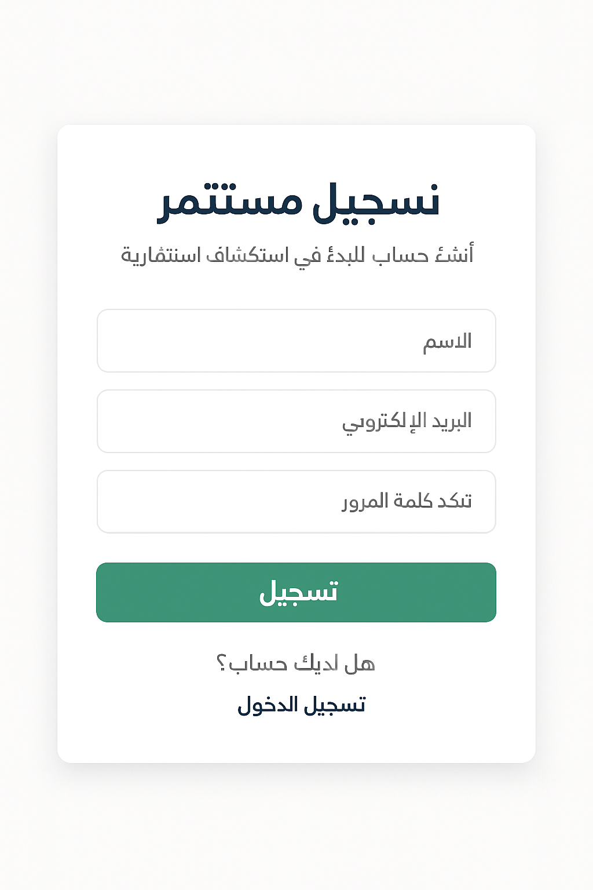
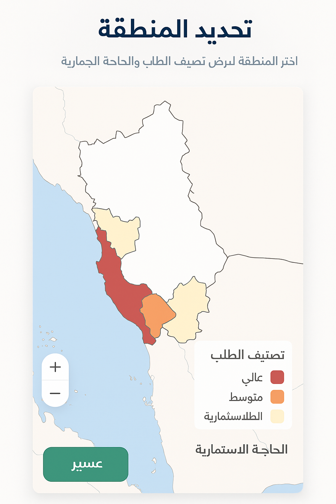
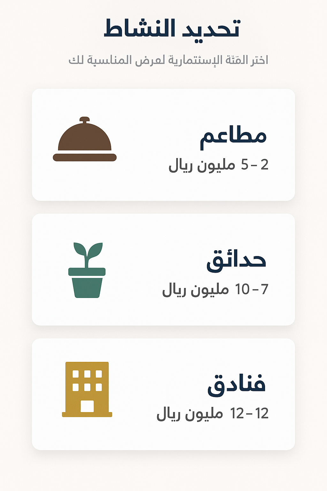
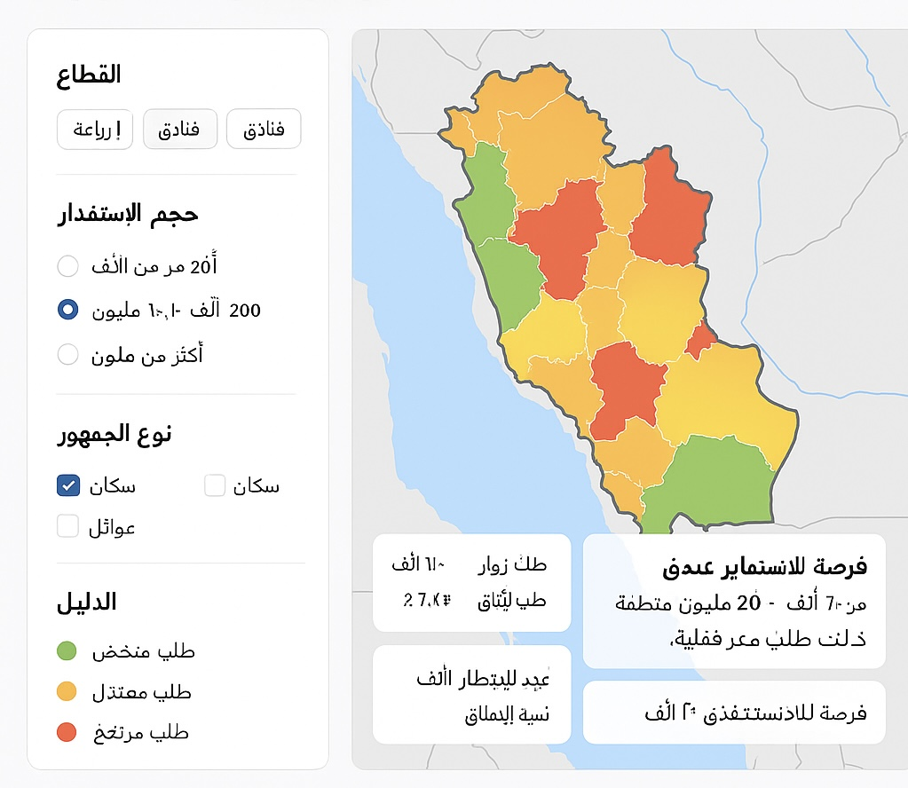
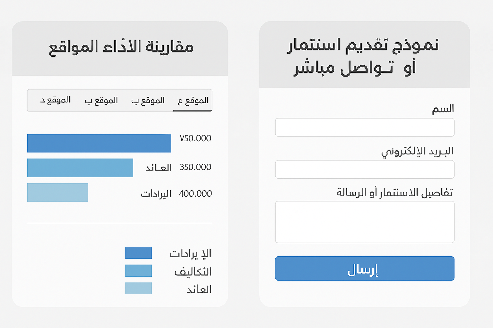

 # 🗺️ خريطة الاستثمار الذكية لعسير | Asir Smart Investment Map

منصة رقمية تفاعلية توفّر خريطة حية ذكية لفرص الاستثمار في منطقة عسير، مدعومة بتحليل بيانات حقيقية وتوصيات فورية للمستثمرين.  
هدفنا: رفع الشفافية، تقليل المخاطر، وتمكين القرار الاستثماري الذكي.

#💡 الفكرة

يواجه المستثمرون صعوبة في تحديد المواقع الأكثر جدوى في عسير بسبب غياب البيانات الدقيقة أو تشتتها.  
منصتنا تحل هذه المشكلة عبر:

- خريطة تفاعلية توضح المناطق حسب الطلب الاستثماري: عالي، متوسط، منخفض.
- اختيار ذكي للنشاط (مطاعم، فنادق، حدائق، محلات...) بناءً على الموقع.
- تحليل مباشر للكثافة والحاجة السوقية لتمكين قرار استثماري مدروس.
- واجهة سلسة تبدأ من تسجيل المستثمر حتى التوصية بالموقع الأنسب.

#🚀 لماذا تهمنا هذه الفكرة؟

1. تعزز الشفافية في قرارات الاستثمار.
2. تدعم أهداف رؤية 2030 في تنمية المناطق وتمكين الاستثمار المحلي.
3. تجمع بين التقنية والاقتصاد في مشروع قابل للتطبيق الفعلي.
4. تُختصر وقت وجهد المستثمرين عبر أدوات ذكية مباشرة.

 #🧠 المميزات الرئيسية

- تصنيف الطلب الاستثماري حسب الموقع: 🔴 مرتفع | 🟡 متوسط | 🟢 منخفض.
- توصيات بناءً على تحليل بيانات الكثافة والحاجة.
- لوحة مقارنة أداء للمواقع (مقارنة الفرص).
- نموذج تواصل مباشر لبدء خطوات الاستثمار.
- تجربة مستخدم مبسطة ومباشرة.

# الفريق 👥

| الاسم | الدور |

| [انس العسيلان ] | مبرمج  
| [تالا الجهني ] | مصممة واجهات وتجربة المستخدم |
| [ليان الجهني ] | تحليل بيانات واستراتيجيات السوق |

> فريق تقني وتحليلي متكامل، يجمع بين البرمجة والتصميم والتفكير الاستثماري.

واجهات المستخدم

# 1. واجهة تسجيل المستثمر

# 2. اختيار منطقة في عسير

# 3. اختيار نوع النشاط الاستثماري

# 4. عرض الخريطة الذكية حسب الطلب

# 5. مقارنة أداء المواقع الاستثمارية

#📁 محتويات المشروع

| المجلد | المحتوى |

# 🎥 الفيديو التعريفي

🔜 سيتم إضافته لاحقًا (مدة: 2 دقائق)

#📌 ملاحظة

هذا المشروع مقدَّم ضمن هاكاثون عسير تبتكر – مسار الاستثمار

# 📬 تواصل معنا

📧 [البريد الإلكتروني الرسمي للفريق]
